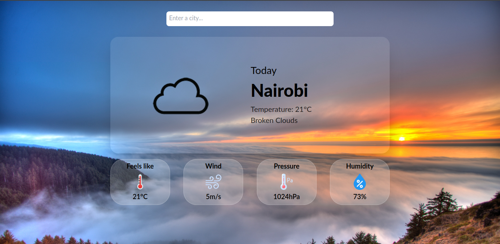

# WeatherWatchdog

This is a simple weather app that provides users with real-time weather information for current or given location.
To enable this you have to allow location access.

## Table of Contents

- [Demo](#demo)
- [Features](#features)
- [Technologies Used](#technologies-used)
- [Getting Started](#getting-started)

## Demo



## Features

- **Current Weather**: Display the current weather conditions, including temperature, humidity, wind speed, and pressure.

- **Search Functionality**: Users can search for the weather in different locations by entering the city name.

- **Responsive Design**: The app is designed to be responsive and accessible across various devices and screen sizes.

## Technologies Used

- [React](https://reactjs.dev/): A JavaScript library for building user interfaces.

- [Vite](https://vitejs.dev/): A fast build tool that enhances the React development experience.

- [TailwindCSS](https://tailwindcss.com/): A utility-first CSS framework for building modern designs.

- [OpenWeatherMapAPI](https://openweathermap.org/): Provides weather data and forecasts based on geographic coordinates or city names.

## Getting Started

1. Clone the repository:

```bash
git clone https://github.com/your-username/weather-app.git
```

2. Navigate to project directory:

```bash
cd weather-app
```

3. Install dependencies:

```bash
yarn install
```

4. Get API Key:

Sign up on the [OpenWeatherMap website](https://openweathermap.org/) and obtain an API key.

5. Configure API Key:

Create a .env file in the project root and add the env variables below.

Remember to replace `your-api-key` with your actual API key from OpenWeatherMap.

```makefile
WEATHER_API_KEY=your-api-key
WEATHER_API_URL=https://api.openweathermap.org/data/2.5
```

6. Run the app:

```bash
yarn run dev
```

7. Open in the Browser:

Visit http://localhost:5173 in your browser to view the app.
